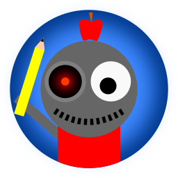

<div id="top">

<!-- HEADER STYLE: CLASSIC -->
<div align="center">



# Teacher Trainer AI (TeachVirt)

<em>AI-Powered Teacher Training and Simulation Platform</em>

<!-- BADGES -->
<!-- local repository, no metadata badges. -->

<em>Built with the tools and technologies:</em>


</div>
<br>

---

## Table of Contents

- [Table of Contents](#table-of-contents)
- [Overview](#overview)
- [Features](#features)
- [Project Structure](#project-structure)
    - [Project Index](#project-index)
- [Getting Started](#getting-started)
    - [Prerequisites](#prerequisites)
    - [Installation](#installation)
    - [Usage](#usage)
    - [Testing](#testing)
- [Roadmap](#roadmap)
- [Contributing](#contributing)
- [License](#license)
- [Acknowledgments](#acknowledgments)

---

## Overview

Teacher Trainer AI (TeachVirt) is an innovative platform designed to help educators improve their teaching skills through AI-powered simulations and feedback. The system uses large language models to simulate classroom interactions and evaluate teaching performance across various challenging scenarios.

**Why TeachVirt?**

Educational institutions need cost-effective and scalable ways to train teachers in handling diverse classroom situations. TeachVirt provides:

• **🎭 Realistic Student Simulations**: Creates lifelike student interactions based on real-world classroom conversations and behaviors.
• **📊 Evidence-Based Evaluations**: Analyzes teacher responses using research-backed best practices for classroom management.
• **🔄 Immediate Feedback**: Provides comprehensive evaluations of teacher performance with specific improvement recommendations.
• **🧠 Specialized Scenarios**: Offers training for specific challenges such as ADHD, behavioral issues, and curriculum-specific interactions.

---

## Features

| Component | Description |
| :-------- | :---------- |
| **AI Simulation** | Realistic student interactions using fine-tuned language models with authentic student conversation data |
| **Scenario Library** | Diverse scenarios based on real classroom challenges including special education needs |
| **Evaluation System** | Research-grounded assessment of teacher responses with detailed feedback |
| **Web Interface** | User-friendly platform for conducting simulated teaching interactions |
| **Knowledge Base** | Vector database of educational research and best practices for informed evaluations |
| **Fine-tuning Pipeline** | Tools for continuously improving model performance with new training data |
| **Multi-grade Support** | Scenarios tailored to different grade levels and subject areas |

---

## Project Structure

```sh
└── teacher-trainer-ai/
    ├── databases/
    │   └── vector/
    │       ├── cache.json
    │       ├── connect.py
    │       └── vector_dv.sqlite
    ├── models/
    │   ├── llm_handler.py
    │   └── ollama_finetune.py
    ├── Training_Data/
    │   ├── Curriculum/
    │   │   ├── Vocab/
    │   │   └── Writing/
    │   ├── Personality/
    │   │   ├── ADHD Child vs. Non-ADHD Child Interview - English (auto-generated).txt
    │   │   ├── Second Grade Conversation - English (auto-generated).txt
    │   │   └── vocabulary.txt
    │   ├── SME_Data/
    │   │   └── four_functions_of_behaviors_example.txt
    │   └── Teacher_Interaction/
    └── website/
        ├── Icon.png
        └── website.py
```

### Project Index

<details open>
    <summary><b>Key Components</b></summary>
    
### Core System
- **llm_handler.py**: Manages interactions with language models and provides teacher evaluation functionality
- **ollama_finetune.py**: Handles fine-tuning of language models with educational conversation data
- **vector_dv.sqlite**: Vector database storing embeddings of educational research for context-aware responses
    
### Training Data
- **Personality/**: Contains transcripts of real student conversations that inform the AI's behavior
- **SME_Data/**: Subject matter expert knowledge on educational best practices
- **Curriculum/**: Subject-specific educational materials
- **Teacher_Interaction/**: Templates and examples of teacher responses to various scenarios

### User Interface
- **website.py**: Web application for interacting with the teacher simulation system
</details>

---

## Getting Started

### Prerequisites

This project requires the following dependencies:

- **Python** 3.8 or higher
- **PyTorch** for embedding generation
- **Sentence Transformers** for vector database operations
- **SQLite** for database storage

### Installation

Build TeachVirt from source and install dependencies:

1. **Clone the repository:**

    ```sh
    git clone https://github.com/username/teacher-trainer-ai.git
    ```

2. **Navigate to the project directory:**

    ```sh
    cd teacher-trainer-ai
    ```

3. **Install the dependencies:**

    ```sh
    pip install -r requirements.txt
    ```

### Usage

Run the web interface with:

```sh
python website/website.py
```

Access the simulation platform through your browser at `http://localhost:8501`.

### Testing

Run the test suite with:

```sh
python -m unittest discover tests
```

---

## Roadmap

- [X] **Initial model training**: Fine-tune language models on educational conversations
- [X] **Vector database implementation**: Create knowledge retrieval system for educational research
- [ ] **Expanded scenario library**: Add more diverse classroom situations
- [ ] **Multi-modal support**: Include audio and visual components in simulations
- [ ] **Performance analytics**: Add detailed tracking of teacher improvement over time

---

## Contributing

- **💬 Join the Discussions**: Share your insights, provide feedback, or ask questions.
- **🐛 Report Issues**: Submit bugs found or log feature requests for the TeachVirt project.
- **💡 Submit Pull Requests**: Review open PRs, and submit your own PRs.

<details closed>
<summary>Contributing Guidelines</summary>

1. **Fork the Repository**: Start by forking the project repository to your GitHub account.
2. **Clone Locally**: Clone the forked repository to your local machine.
3. **Create a New Branch**: Always work on a new branch with a descriptive name.
4. **Make Your Changes**: Develop and test your changes locally.
5. **Commit Your Changes**: Commit with a clear message describing your updates.
6. **Push to GitHub**: Push the changes to your forked repository.
7. **Submit a Pull Request**: Create a PR against the original project repository.
8. **Review**: Once your PR is reviewed and approved, it will be merged.
</details>

---

## License

Teacher Trainer AI is released under the MIT License. For more details, refer to the [LICENSE](LICENSE) file.

---

## Acknowledgments

- Special thanks to all educators who contributed to the training data
- The research community for providing educational best practices
- Open-source language model developers whose work forms the foundation of this project

<div align="right">

[![][back-to-top]](#top)

</div>


[back-to-top]: https://img.shields.io/badge/-BACK_TO_TOP-151515?style=flat-square
